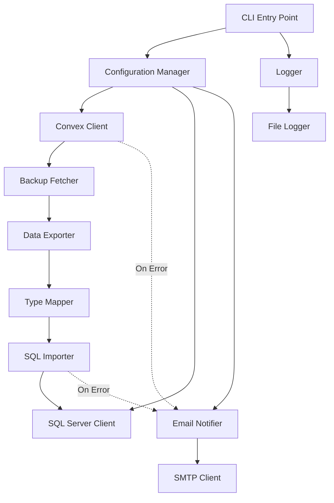
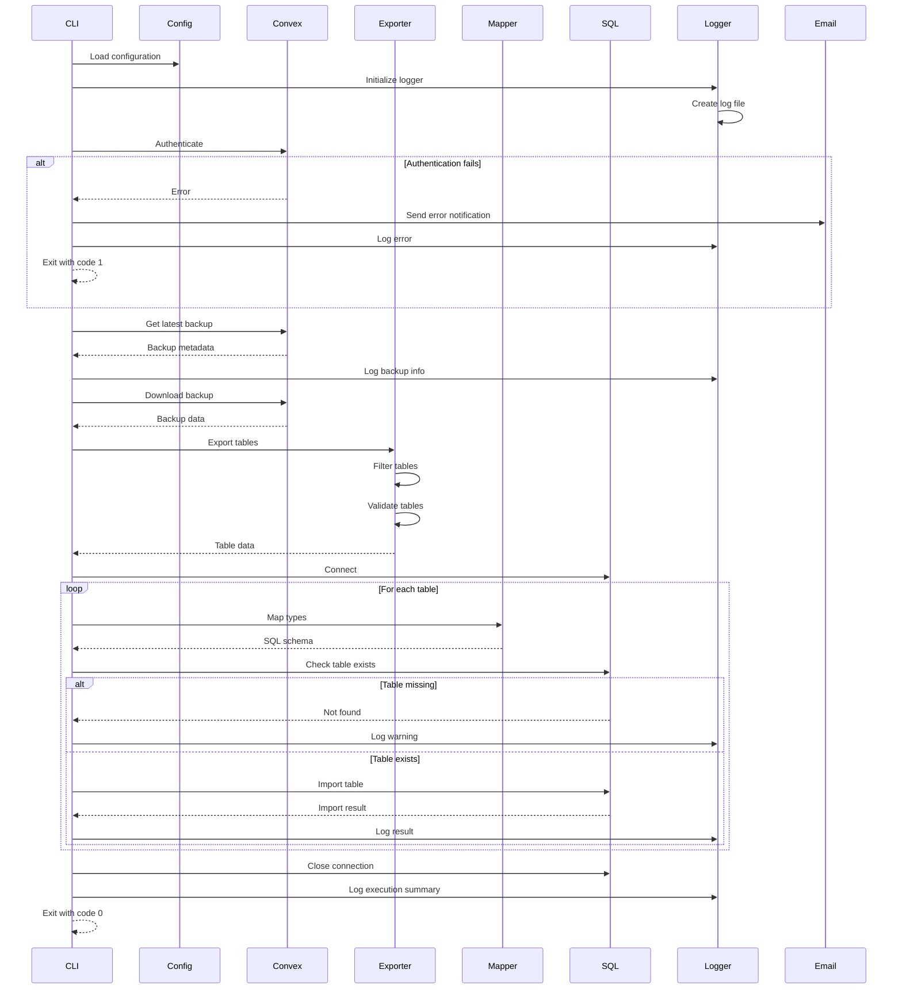

# Design Document: Convex to SQL Server Sync

## Overview

Il sistema è uno script Python eseguibile da linea di comando che automatizza l'export di dati dall'ultimo backup di Convex e l'import in un Data Warehouse SQL Server. Lo script è progettato per essere parametrizzabile, riutilizzabile per multiple applicazioni Convex, e schedulabile tramite Task Manager di Windows.

Il flusso principale è:
1. Caricamento configurazione e validazione parametri
2. Autenticazione con Convex usando Deploy/Admin Key
3. Recupero dell'ultimo backup disponibile
4. Download dei dati delle tabelle selezionate
5. Connessione a SQL Server
6. Import dei dati con mappatura dei tipi
7. Logging dei risultati e notifica email in caso di errore

## Architecture

### Architettura a Componenti



### Separazione delle Responsabilità

- **CLI Entry Point**: Gestisce argomenti da linea di comando e orchestrazione principale
- **Configuration Manager**: Carica e valida il file di configurazione JSON
- **Convex Client**: Gestisce autenticazione e comunicazione con API Convex
- **Backup Fetcher**: Identifica e recupera l'ultimo backup disponibile
- **Data Exporter**: Scarica i dati delle tabelle selezionate dal backup
- **Type Mapper**: Converte tipi di dati Convex in tipi SQL Server
- **SQL Importer**: Gestisce connessione e import dati in SQL Server
- **Logger**: Gestisce logging su file con timestamp
- **Email Notifier**: Invia notifiche email in caso di errore

## Components and Interfaces

### 1. CLI Entry Point

**Responsabilità**: Punto di ingresso dello script, parsing argomenti, orchestrazione del flusso

**Interface**:
```python
def main(app_name: str, config_path: str = "config.json") -> int:
    """
    Entry point principale dello script
    
    Args:
        app_name: Nome dell'applicazione Convex da processare
        config_path: Path al file di configurazione (default: config.json)
    
    Returns:
        Exit code: 0 per successo, non-zero per errore
    """
```

### 2. Configuration Manager

**Responsabilità**: Caricamento, validazione e accesso alla configurazione

**Interface**:
```python
class ConfigurationManager:
    def load_config(self, config_path: str) -> Config:
        """Carica e valida il file di configurazione"""
    
    def get_convex_config(self, app_name: str) -> ConvexConfig:
        """Ottiene configurazione per una specifica app Convex"""
    
    def get_sql_config(self) -> SQLConfig:
        """Ottiene configurazione SQL Server"""
    
    def get_email_config(self) -> EmailConfig:
        """Ottiene configurazione email"""
```

**Data Models**:
```python
@dataclass
class ConvexConfig:
    app_name: str
    deploy_key: str
    tables: Optional[List[str]] = None  # None = tutte le tabelle

@dataclass
class SQLConfig:
    connection_string: str
    schema: str
    timeout: int = 30

@dataclass
class EmailConfig:
    smtp_host: str
    smtp_port: int
    smtp_user: str
    smtp_password: str
    from_email: str
    to_emails: List[str]
    use_tls: bool = True

@dataclass
class Config:
    convex_apps: Dict[str, ConvexConfig]
    sql: SQLConfig
    email: EmailConfig
    log_dir: str = "logs"
    retry_attempts: int = 3
    retry_backoff: float = 2.0
```

### 3. Convex Client

**Responsabilità**: Autenticazione e comunicazione con API Convex

**Interface**:
```python
class ConvexClient:
    def __init__(self, deploy_key: str):
        """Inizializza client con deploy key"""
    
    def authenticate(self) -> bool:
        """Verifica validità della deploy key"""
    
    def list_backups(self, app_name: str) -> List[Backup]:
        """Lista tutti i backup disponibili per l'app"""
    
    def get_latest_backup(self, app_name: str) -> Backup:
        """Ottiene l'ultimo backup disponibile"""
    
    def download_backup(self, backup: Backup) -> BackupData:
        """Scarica i dati dal backup"""
```

**Data Models**:
```python
@dataclass
class Backup:
    id: str
    app_name: str
    timestamp: datetime
    size_bytes: int
    status: str

@dataclass
class BackupData:
    tables: Dict[str, List[Dict[str, Any]]]  # table_name -> rows
    metadata: Dict[str, Any]
```

### 4. Data Exporter

**Responsabilità**: Estrazione e filtraggio dati dal backup

**Interface**:
```python
class DataExporter:
    def export_tables(
        self, 
        backup_data: BackupData, 
        table_filter: Optional[List[str]] = None
    ) -> Dict[str, TableData]:
        """
        Esporta tabelle dal backup
        
        Args:
            backup_data: Dati del backup
            table_filter: Lista tabelle da esportare (None = tutte)
        
        Returns:
            Dizionario table_name -> TableData
        """
    
    def validate_tables(
        self, 
        backup_data: BackupData, 
        requested_tables: List[str]
    ) -> Tuple[List[str], List[str]]:
        """
        Valida esistenza tabelle richieste
        
        Returns:
            (tabelle_valide, tabelle_mancanti)
        """
```

**Data Models**:
```python
@dataclass
class TableData:
    name: str
    rows: List[Dict[str, Any]]
    schema: Dict[str, str]  # column_name -> convex_type
    row_count: int
```

### 5. Type Mapper

**Responsabilità**: Mappatura tipi di dati Convex a SQL Server

**Interface**:
```python
class TypeMapper:
    def map_convex_to_sql(self, convex_type: str) -> str:
        """Mappa tipo Convex a tipo SQL Server"""
    
    def convert_value(self, value: Any, convex_type: str) -> Any:
        """Converte valore da formato Convex a formato SQL Server"""
    
    def get_table_schema_sql(self, table_data: TableData) -> str:
        """Genera SQL CREATE TABLE per una tabella Convex"""
```

**Mappatura Tipi**:
```
Convex Type     -> SQL Server Type
----------------------------------------
string          -> NVARCHAR(MAX)
number          -> FLOAT
boolean         -> BIT
null            -> NULL
id              -> NVARCHAR(50)
array           -> NVARCHAR(MAX) (JSON)
object          -> NVARCHAR(MAX) (JSON)
```

### 6. SQL Importer

**Responsabilità**: Connessione a SQL Server e import dati

**Interface**:
```python
class SQLImporter:
    def __init__(self, connection_string: str, schema: str):
        """Inizializza connessione SQL Server"""
    
    def connect(self) -> bool:
        """Stabilisce connessione a SQL Server"""
    
    def table_exists(self, table_name: str) -> bool:
        """Verifica se tabella esiste nello schema"""
    
    def import_table(
        self, 
        table_data: TableData, 
        type_mapper: TypeMapper
    ) -> ImportResult:
        """
        Importa dati di una tabella
        
        Returns:
            Risultato dell'import con statistiche
        """
    
    def bulk_insert(
        self, 
        table_name: str, 
        rows: List[Dict[str, Any]]
    ) -> int:
        """
        Esegue bulk insert ottimizzato
        
        Returns:
            Numero di righe inserite
        """
    
    def close(self):
        """Chiude connessione"""
```

**Data Models**:
```python
@dataclass
class ImportResult:
    table_name: str
    success: bool
    rows_imported: int
    error: Optional[str] = None
    duration_seconds: float = 0.0
```

### 7. Logger

**Responsabilità**: Logging strutturato su file

**Interface**:
```python
class SyncLogger:
    def __init__(self, log_dir: str, app_name: str):
        """Inizializza logger con directory e nome app"""
    
    def info(self, message: str, **context):
        """Log messaggio informativo"""
    
    def warning(self, message: str, **context):
        """Log warning"""
    
    def error(self, message: str, error: Exception = None, **context):
        """Log errore con stack trace opzionale"""
    
    def log_execution_start(self, params: Dict[str, Any]):
        """Log inizio esecuzione con parametri"""
    
    def log_execution_end(self, success: bool, duration: float, stats: Dict[str, Any]):
        """Log fine esecuzione con statistiche"""
```

**Formato Log**:
```
[2024-12-22 10:30:15] [INFO] Execution started - app: my-app, tables: all
[2024-12-22 10:30:16] [INFO] Authenticated with Convex successfully
[2024-12-22 10:30:17] [INFO] Latest backup found - id: backup_123, timestamp: 2024-12-22 09:00:00
[2024-12-22 10:30:20] [INFO] Downloaded backup - size: 1.2MB, tables: 5
[2024-12-22 10:30:21] [INFO] Exporting table: users - rows: 150
[2024-12-22 10:30:22] [INFO] Imported table: users - rows: 150, duration: 0.8s
[2024-12-22 10:30:25] [INFO] Execution completed - success: true, duration: 10.2s, tables: 5, total_rows: 450
```

### 8. Email Notifier

**Responsabilità**: Invio notifiche email in caso di errore

**Interface**:
```python
class EmailNotifier:
    def __init__(self, config: EmailConfig):
        """Inizializza con configurazione SMTP"""
    
    def send_error_notification(
        self, 
        app_name: str, 
        error_type: str, 
        error_message: str, 
        stack_trace: str,
        timestamp: datetime
    ) -> bool:
        """
        Invia email di notifica errore
        
        Returns:
            True se email inviata con successo
        """
```

**Template Email**:
```
Subject: [ERROR] Convex Sync Failed - {app_name}

Convex to SQL Server Sync Error Report

Application: {app_name}
Timestamp: {timestamp}
Error Type: {error_type}

Error Message:
{error_message}

Stack Trace:
{stack_trace}

Please check the logs for more details.
```

## Data Models

### Configuration File Format (JSON)

```json
{
  "convex_apps": {
    "my-app": {
      "deploy_key": "prod:xxxxx|yyyyy",
      "tables": ["users", "orders", "products"]
    },
    "another-app": {
      "deploy_key": "prod:aaaaa|bbbbb",
      "tables": null
    }
  },
  "sql_server": {
    "connection_string": "Server=myserver;Database=DWH;User Id=user;Password=pass;",
    "schema": "convex_data",
    "timeout": 30
  },
  "email": {
    "smtp_host": "smtp.gmail.com",
    "smtp_port": 587,
    "smtp_user": "notifications@example.com",
    "smtp_password": "password",
    "from_email": "notifications@example.com",
    "to_emails": ["admin@example.com"],
    "use_tls": true
  },
  "log_dir": "logs",
  "retry_attempts": 3,
  "retry_backoff": 2.0
}
```

### Execution Flow




## Correctness Properties

*Una property è una caratteristica o comportamento che deve essere vero per tutte le esecuzioni valide di un sistema - essenzialmente, una dichiarazione formale su cosa il sistema dovrebbe fare. Le properties servono come ponte tra le specifiche leggibili dall'uomo e le garanzie di correttezza verificabili automaticamente.*

### Property 1: Latest Backup Retrieval
*Per qualsiasi* applicazione Convex configurata con credenziali valide, quando lo script viene eseguito, deve recuperare il backup con il timestamp più recente tra tutti i backup disponibili per quella applicazione.

**Validates: Requirements 1.1**

### Property 2: Backup Download Completeness
*Per qualsiasi* backup identificato, tutti i dati contenuti nel backup devono essere scaricati completamente senza perdita di informazioni.

**Validates: Requirements 1.2**

### Property 3: Authentication Error Handling
*Per qualsiasi* chiave di autenticazione non valida o scaduta, lo script deve registrare un errore di autenticazione nel log e terminare con exit code non-zero senza procedere con l'export.

**Validates: Requirements 1.3, 1.6**

### Property 4: Table Filtering
*Per qualsiasi* configurazione che specifica una lista di tabelle, lo script deve esportare esattamente e solo le tabelle presenti in quella lista, ignorando tutte le altre tabelle disponibili nel backup.

**Validates: Requirements 2.1**

### Property 5: Missing Table Resilience
*Per qualsiasi* lista di tabelle richieste che include tabelle non esistenti nel backup, lo script deve registrare un warning per ogni tabella mancante e continuare l'export delle tabelle esistenti senza terminare l'esecuzione.

**Validates: Requirements 2.3**

### Property 6: Table Name Validation
*Per qualsiasi* input di nomi di tabelle, lo script deve validare che i nomi siano conformi alle regole di naming (non vuoti, caratteri validi) prima di iniziare l'export.

**Validates: Requirements 2.4**

### Property 7: SQL Connection After Export
*Per qualsiasi* export completato con successo da Convex, lo script deve tentare di stabilire una connessione a SQL Server usando le credenziali configurate prima di procedere con l'import.

**Validates: Requirements 3.1**

### Property 8: Data Import Completeness
*Per qualsiasi* set di dati esportati da Convex, tutti i record devono essere importati nelle tabelle SQL Server corrispondenti, e il numero di record importati deve essere uguale al numero di record esportati.

**Validates: Requirements 3.2, 3.5**

### Property 9: Missing SQL Table Resilience
*Per qualsiasi* tabella di destinazione che non esiste nello schema SQL Server, lo script deve registrare un errore per quella tabella e continuare con l'import delle altre tabelle senza terminare l'esecuzione.

**Validates: Requirements 3.3, 8.1**

### Property 10: Type Mapping Consistency
*Per qualsiasi* valore di un tipo Convex supportato (string, number, boolean, id, array, object), la mappatura al tipo SQL Server corrispondente deve preservare il valore e permettere il round-trip (Convex → SQL → Convex produce un valore equivalente).

**Validates: Requirements 3.4**

### Property 11: Configuration File Completeness
*Per qualsiasi* file di configurazione valido, deve contenere tutti i campi obbligatori: almeno una applicazione Convex con deploy_key, connection_string SQL Server, e configurazioni email complete (smtp_host, smtp_port, smtp_user, smtp_password, from_email, to_emails).

**Validates: Requirements 4.2, 4.3, 4.5, 4.6**

### Property 12: Invalid Configuration Handling
*Per qualsiasi* file di configurazione mancante, malformato o con campi obbligatori mancanti, lo script deve terminare con exit code non-zero e un messaggio di errore che specifica quale campo o validazione è fallita.

**Validates: Requirements 4.7**

### Property 13: Multi-App Configuration Support
*Per qualsiasi* file di configurazione con N applicazioni Convex (N ≥ 1), lo script deve essere in grado di processare ciascuna applicazione indipendentemente quando specificata come parametro, usando la deploy_key e le configurazioni specifiche di quella applicazione.

**Validates: Requirements 4.8**

### Property 14: Error Email Notification
*Per qualsiasi* errore critico durante l'export da Convex o l'import su SQL Server, lo script deve inviare una email che contiene il timestamp dell'errore, il nome dell'applicazione, il messaggio di errore e lo stack trace completo.

**Validates: Requirements 5.1, 5.2, 5.3**

### Property 15: Email Failure Resilience
*Per qualsiasi* fallimento nell'invio della email di notifica, lo script deve registrare l'errore di invio email nel log ma continuare l'esecuzione normale senza terminare.

**Validates: Requirements 5.5**

### Property 16: Log File Creation
*Per qualsiasi* esecuzione dello script, deve essere creato un file di log con nome contenente timestamp nel formato `sync_{app_name}_{YYYYMMDD_HHMMSS}.log` nella directory configurata.

**Validates: Requirements 6.1**

### Property 17: Comprehensive Logging
*Per qualsiasi* esecuzione dello script, il file di log deve contenere: parametri di esecuzione all'inizio, risultato (successo/fallimento) di ogni operazione principale, numero di record processati per ogni tabella, e tempo totale di esecuzione con stato finale alla fine.

**Validates: Requirements 6.2, 6.3, 6.4, 6.5**

### Property 18: Exit Code Correctness
*Per qualsiasi* esecuzione dello script, l'exit code deve essere 0 se e solo se tutte le operazioni critiche (autenticazione, export, connessione SQL, import di almeno una tabella) sono completate con successo, altrimenti deve essere non-zero.

**Validates: Requirements 7.2**

### Property 19: Path Handling
*Per qualsiasi* path specificato per file di configurazione o directory di log (relativo o assoluto), lo script deve risolverlo correttamente e accedere al file/directory senza errori di path.

**Validates: Requirements 7.4**

### Property 20: Retry with Exponential Backoff
*Per qualsiasi* operazione di rete (chiamate API Convex, connessione SQL) che fallisce con errore temporaneo, lo script deve ritentare l'operazione fino a 3 volte con delay crescente esponenzialmente (1s, 2s, 4s) prima di considerare l'operazione fallita.

**Validates: Requirements 8.2**

### Property 21: Data Validation Before Import
*Per qualsiasi* set di dati da importare, lo script deve validare che i valori siano compatibili con i tipi SQL Server target prima di eseguire l'import, e rigettare record con dati non validi registrando l'errore.

**Validates: Requirements 8.4**

### Property 22: Partial Import Logging
*Per qualsiasi* esecuzione in cui alcune tabelle vengono importate con successo e altre falliscono, il log finale deve elencare esplicitamente quali tabelle sono state importate con successo e quali hanno fallito con i rispettivi errori.

**Validates: Requirements 8.5**

## Error Handling

### Error Categories

1. **Configuration Errors** (Exit Code: 1)
   - File di configurazione mancante o malformato
   - Campi obbligatori mancanti
   - Valori di configurazione non validi

2. **Authentication Errors** (Exit Code: 2)
   - Deploy key non valida o scaduta
   - Credenziali SQL Server non valide
   - Permessi insufficienti

3. **Network Errors** (Exit Code: 3)
   - Impossibile raggiungere API Convex
   - Impossibile connettersi a SQL Server
   - Timeout di rete

4. **Data Errors** (Exit Code: 4)
   - Backup non disponibile
   - Tabella non trovata
   - Errori di validazione dati
   - Errori di mappatura tipi

5. **Import Errors** (Exit Code: 5)
   - Errori durante bulk insert
   - Violazioni di integrità
   - Errori SQL

### Retry Strategy

**Operazioni con Retry**:
- Chiamate API Convex (list backups, download backup)
- Connessione a SQL Server
- Bulk insert operations

**Configurazione Retry**:
- Max attempts: 3
- Backoff: Esponenziale (1s, 2s, 4s)
- Retry su: Errori di rete temporanei, timeout
- No retry su: Errori di autenticazione, errori di validazione

**Implementazione**:
```python
def retry_with_backoff(func, max_attempts=3, backoff_factor=2.0):
    """
    Esegue funzione con retry e backoff esponenziale
    
    Args:
        func: Funzione da eseguire
        max_attempts: Numero massimo di tentativi
        backoff_factor: Fattore di crescita del delay
    
    Returns:
        Risultato della funzione
    
    Raises:
        Ultima eccezione se tutti i tentativi falliscono
    """
    for attempt in range(max_attempts):
        try:
            return func()
        except TemporaryError as e:
            if attempt == max_attempts - 1:
                raise
            delay = backoff_factor ** attempt
            time.sleep(delay)
            logger.warning(f"Retry {attempt + 1}/{max_attempts} after {delay}s")
```

### Error Recovery

**Partial Failure Handling**:
- Se una tabella fallisce durante l'export/import, lo script continua con le altre tabelle
- Ogni tabella è processata in modo indipendente
- Il log finale indica quali tabelle hanno avuto successo e quali hanno fallito

**Email Notification Failure**:
- Se l'invio email fallisce, viene registrato nel log
- L'esecuzione continua normalmente
- L'exit code non è influenzato dal fallimento dell'email

**Logging su Errore**:
- Ogni errore viene registrato con timestamp, tipo, messaggio e stack trace
- Gli errori critici vengono registrati prima di terminare l'esecuzione
- Gli errori non critici vengono registrati ma l'esecuzione continua

## Testing Strategy

### Dual Testing Approach

Il sistema sarà testato usando sia unit tests che property-based tests:

- **Unit tests**: Verificano esempi specifici, casi edge e condizioni di errore
- **Property tests**: Verificano proprietà universali su tutti gli input possibili

Entrambi i tipi di test sono complementari e necessari per una copertura completa.

### Property-Based Testing

**Framework**: Utilizzeremo **Hypothesis** per Python, che è il framework standard per property-based testing in Python.

**Configurazione**:
- Minimo 100 iterazioni per ogni property test
- Ogni test deve referenziare la property del design document
- Tag format: `# Feature: convex-to-sqlserver-sync, Property N: [property text]`

**Generators Personalizzati**:

```python
from hypothesis import strategies as st

# Generator per configurazioni Convex valide
@st.composite
def convex_config(draw):
    app_name = draw(st.text(min_size=1, max_size=50, alphabet=st.characters(whitelist_categories=('Ll', 'Lu', 'Nd'), whitelist_characters='-_')))
    deploy_key = draw(st.text(min_size=20, max_size=100))
    tables = draw(st.one_of(st.none(), st.lists(st.text(min_size=1, max_size=50), min_size=1, max_size=10)))
    return ConvexConfig(app_name=app_name, deploy_key=deploy_key, tables=tables)

# Generator per dati tabella
@st.composite
def table_data(draw):
    name = draw(st.text(min_size=1, max_size=50, alphabet=st.characters(whitelist_categories=('Ll', 'Lu'), whitelist_characters='_')))
    num_rows = draw(st.integers(min_value=0, max_value=1000))
    rows = [draw(row_data()) for _ in range(num_rows)]
    return TableData(name=name, rows=rows, row_count=num_rows)

# Generator per valori Convex
@st.composite
def convex_value(draw):
    return draw(st.one_of(
        st.text(),  # string
        st.floats(allow_nan=False, allow_infinity=False),  # number
        st.booleans(),  # boolean
        st.none(),  # null
        st.text(min_size=16, max_size=16),  # id
    ))
```

**Esempio Property Test**:

```python
from hypothesis import given, settings
import hypothesis.strategies as st

@given(convex_config())
@settings(max_examples=100)
def test_property_4_table_filtering(config):
    """
    Feature: convex-to-sqlserver-sync, Property 4: Table Filtering
    
    Per qualsiasi configurazione che specifica una lista di tabelle,
    lo script deve esportare esattamente e solo le tabelle presenti in quella lista.
    """
    # Arrange: crea backup con più tabelle
    all_tables = ['users', 'orders', 'products', 'reviews', 'categories']
    backup_data = create_mock_backup(all_tables)
    
    # Act: esporta con filtro
    if config.tables:
        exporter = DataExporter()
        exported = exporter.export_tables(backup_data, config.tables)
        
        # Assert: solo le tabelle richieste sono esportate
        assert set(exported.keys()) == set(config.tables).intersection(set(all_tables))
        assert len(exported) <= len(config.tables)
```

### Unit Testing

**Framework**: pytest

**Aree di Focus**:
- Parsing e validazione configurazione
- Mappatura tipi Convex → SQL Server
- Gestione errori specifici
- Formattazione log e email
- CLI argument parsing

**Esempio Unit Test**:

```python
def test_invalid_config_file_missing():
    """Test che file di configurazione mancante generi errore appropriato"""
    with pytest.raises(ConfigurationError) as exc_info:
        config_manager = ConfigurationManager()
        config_manager.load_config("nonexistent.json")
    
    assert "Configuration file not found" in str(exc_info.value)

def test_type_mapping_convex_string_to_sql():
    """Test mappatura tipo string da Convex a SQL Server"""
    mapper = TypeMapper()
    sql_type = mapper.map_convex_to_sql("string")
    assert sql_type == "NVARCHAR(MAX)"

def test_email_notification_contains_required_fields():
    """Test che email di errore contenga tutti i campi richiesti"""
    notifier = EmailNotifier(mock_email_config())
    email_content = notifier.format_error_email(
        app_name="test-app",
        error_type="ExportError",
        error_message="Failed to download backup",
        stack_trace="...",
        timestamp=datetime.now()
    )
    
    assert "test-app" in email_content
    assert "ExportError" in email_content
    assert "Failed to download backup" in email_content
    assert "..." in email_content  # stack trace
```

### Integration Testing

**Scope**: Test end-to-end con mock di Convex API e SQL Server locale

**Test Cases**:
1. Export completo da Convex mock a SQL Server locale
2. Export parziale con alcune tabelle mancanti
3. Retry su errori di rete temporanei
4. Invio email su errore critico
5. Logging completo di esecuzione

### Manual Testing

**Checklist**:
- [ ] Esecuzione con Task Manager di Windows
- [ ] Schedulazione giornaliera
- [ ] Notifiche email ricevute correttamente
- [ ] Log files creati nella directory corretta
- [ ] Performance con dataset reali (> 10k records)
- [ ] Gestione di backup di grandi dimensioni (> 100MB)

### Test Coverage Goals

- **Unit tests**: > 80% code coverage
- **Property tests**: Tutte le 22 properties implementate
- **Integration tests**: Scenari principali coperti
- **Manual tests**: Checklist completata prima del rilascio
